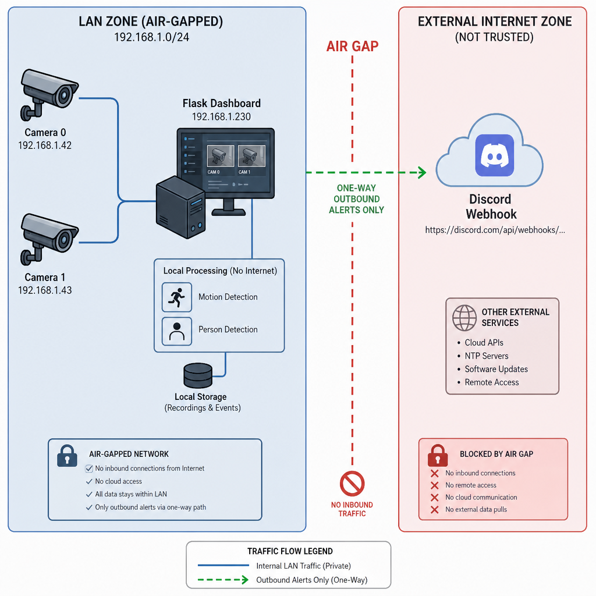

##
# SpiderWebSecurity<bold>

 SpiderWebSecurity is a professional local network security monitoring system built with Python, Flask, and OpenCV. If making any changes or deploying it within another program entirley I just ask you credit 20cdelmonaco AKA Eskee
- SpiderWebSecurity delivers real‑time, multi‑camera surveillance with integrated motion and person detection, providing automated, webhook‑based alerts for secure, air‑gapped environments.

- Runs locally on computers and even wifi cameras that are not password protected, or without proper credentials. As of the first release, this option was left intentionally out for security reasons feel free to do as you like . 

## <bold>Setup<bold>
- Download from [Requirments.txt](requirements.txt)
- Make sure git is downloaded if not already
1. git clone https://github.com/20cdelmonaco/SpiderWebSecurity
2. python spiderwebsec.py
- Change Webhook Identification (ONLY USE SECURE SERVICES)
## Features:
- SOUND COMING SOON!!!!
- Live camera Dashboard with MJPEG streaming
- Motion detection and person recognition using OpenCV HOG
- Discord webhook alerts with bundled image attachments
- Lightweight, self-hosted design for closed networks

## Features:
- Live camera dashboard with MJPEG streaming
- Motion detection and person recognition using OpenCV HOG
- Discord webhook alerts with bundled image attachments
- Lightweight, self-hosted design for closed networks

# THIS IS A NEW PROGRAM MADE ENTIRLEY FROM PYTHON AVOIDING ANY HTML BY USING FLASK FOR A DASHBOARD 
- (This makes it easier to integrate mutiple sources (computer or camera) to the same webhook while running multiple copies of the same program, on the same network), 

THAT BEING SAID THIS IS A VERY FRAGILE SYSTEM AND WILL MOST LIKELY BREAK OR CAUSE A HEADACHE IF NOT CONFIGURED PROPERLY. WILL UPDATE SOON JUST PUSHING CAUSE I FIGURED THE APP IS DEPLOYABLE AND THAT I MIGHT BE ABLE TO FIND MORE BUGS THIS WAY. :) ENJOY, HAVE FUN, LEARN!!!